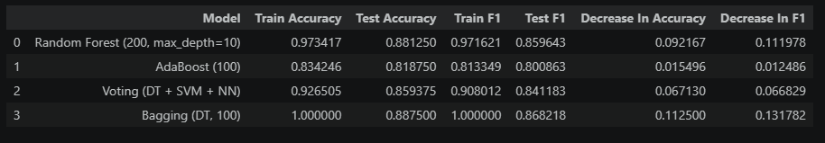

# Project Documentation

This site provides project documentation.
Use the documentation navigation to explore.

## How-To Guide

Many instructions are common to all our projects.

See
[⭐ **Workflow: Apply Example**](https://denisecase.github.io/pro-analytics-02/workflow-b-apply-example-project/)
to get the example projects running on your machine.

## Project Documentation Pages (docs/)

- **Home** - this documentation landing page
- [**Project Instructions**](./project-instructions.md)  - the standard project workflow
- [**Your Files**](./your-files.md) - how to copy the example and create your version
- [**Glossary**](./glossary.md) - project terms and concepts
- [**API**](./api.md) - autogenerated code documentation for the public project interface

## Phase 4. Technical Modification

In phase 4, I changed the dataset used to a diabetes prediction dataset from kaggle. https://www.kaggle.com/datasets/rishitjakharia/diabetes-prediction?select=diabetes.csv. I decided to change the dataset because I wanted practice running through an entire problem. I also wanted to review how to load in a CSV instead of using a seaborn library, which is why I found a dataset on kaggle.

It was a supervised, classification problem to see if we could predict which people had diabetes.

Since I changed the dataset I had to change the target and the features. I kept the train/test split the same.

I played around with the settings in the decision tree classifier and random forest classifier until I had the highest accuracy for each test. This resulted in a max depth of 4 for the decision tree classifier and an n-estimator of 100 for the random forest classifier.

This resulted in the single tree test having a higher accuracy than an ensemble, which was not the case for the example project. This shows that complication, or adding extra work/steps, does not always result in more accuracy.

This modification was easy, but took a little more time as I had to problems solve when trying to load the CSV and fine tuning the settings for the different models.

## Phase 5. Custom Project

For my custom project I followed the Project 5 Directions. It used the Red Wine Dataset from UCI Machine Learning Repository and can be found here: https://archive.ics.uci.edu/dataset/186/wine+quality

### Basis and Data

Before I loaded the data I formatted the CSV to columns instead of being separated by a semicolon, and I adjusted the names to fit the standard formatting guidelines to make it easier to use in the project. While separating the data was done in the original code given, I prefer to separate it out myself and adjust the column names to follow standard formatting rules. I find that if I have names that don't follow the rules, I have difficulty with my code later on. Because I am more proficient in excel, it is easier for me to make those simple changes before loading it into the notebook.

The data set is all numerical, and provides different features of wine along with the quality, or 0 to 10 score a person gave it. The project 5 directions gave a brief explanation of what the different features meant.

We added two columns to the data. First we created a categorical column of "low", "medium", and "high" based off its quality score, and then we turned that into a numerical value so we could use it in our analysis.

If we were going deeper into this data it would be helpful to also know the ranges for each feature as I don't know if a 1.9 for residual sugar means a lot of sugar or a small amount of sugar.

### Modeling Approach

This is supervised learning as we already know what scores the wines got. It is regression as all of our values are numerical. Even when we created the additional columns, we made sure to make a numerical version of it so that it could be used in the models.

We picked which ensemble models we wanted to compare. I picked 4 models to see the varying types of ensemble models applied to the data. Because we are still learning this material, I wanted a wide variety and tried to pick different types of models.

 I chose the Random Forest, but since we did a random forest in phase 4 of the project, I decided to go with the one with different limitations; 200, max depth = 10. I chose Ada Boost to see a boosting example. I chose bagging to see a bagging example. Lastly I chose the voting example with the decision tree, SVM, and neural network ( DT + SVM + NN) since these were regression models we used in the previous weeks, so I could see how they all worked together.

### Target

The target variable is quality_numeric. This sorted the quality score into low, medium, and high categories, with scores of 0, 1, and 2 respectively.

This target allows us to use the regression models to try to determine which characteristics of a wine will place it in the highest category and conversely which characteristics place wine in the lowest category.

### Features

The features are all other columns with the exception of the quality, and created quality_label columns. We did not include these columns because they have the same data or value as the quality_numeric column, just represented in different ways. This means that if they were included in the model they would skew the results as we would have the same data in both the target and the features.

### Evaluation and Results

After running all four models, I compiled their results in a table. I then added the decrease in accuracy between the training and testing data, along with the decrease in F1 between the training and testing data.

All models performed moderately well as they all had testing accuracy and F1 scores of 80% or higher. The models ranked highest to least in both test accuracy and test F1 are: Begging, Random Forest, Voting, AdaBoost.

I think it would have been worth while to run all 10 of the models. While I do feel as though the models I chose covered a range of model types, it doesn't fully help me understand why the AdaBoost model did the worst and how the Bagging model had training scores of 1.0. I don't know what it is about this data set that helped make that possible.

### Summary

I ran 4 ensemble models to try to learn which wines earned the highest quality score. After running the models I created a table to compare the accuracy and F1 of the models. The Bagging model ran the best, and the AdaBoost model was the worst, but still managed a minimum of 80%.

Summary of Results of All 4 Models

These models can be applied to any regression data set. You could use this to predict which types of goods customers would buy based on previous purchases.
